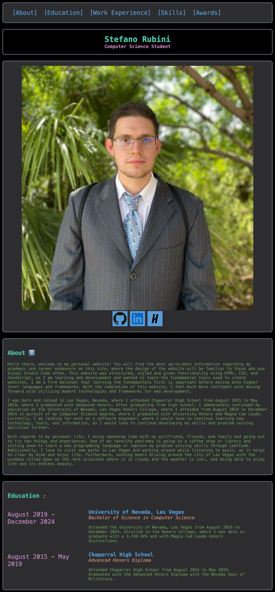

# 🌐 Stefano Rubini — Resume Website

Welcome to the repository for my personal resume website.
This project was designed to highlight my background, skills, and experience in a professional, easy-to-navigate, and responsive format.

🌐 Live Website: [View on Vercel](https://personal-website-puce-ten-15.vercel.app/)

 

## 👀 Preview

  

 

## 📖 About the Project
This site serves as my interactive resume and portfolio, allowing recruiters and professionals to:
- Learn about my education, work experience, skills, and awards
- Explore a clean, mobile-first design that adapts to any device
- Easily navigate sections using a sticky navigation bar and hamburger menu

 

## 🚀 Features
- Fully **responsive** (desktop, tablet, mobile)  
- Clean design tailored for **recruiters and hiring managers**  
- Sticky navigation with smooth scrolling  
- Collapsible **hamburger menu** on mobile  
- Easy to update with new experiences and skills

 

## 🛠️ Tech Stack
- **HTML5** & **CSS3** (custom styling, no heavy frameworks)  
- **JavaScript** (for interactive navigation)  
- **Vercel** (for deployment & hosting)

 

## 📬 Contact
- **LinkedIn:** [linkedin.com/in/stefano-rubini-aa38a6296](https://www.linkedin.com/in/stefano-rubini-aa38a6296/)  
- **GitHub:** [github.com/StefanoRubini](https://github.com/StefanoRubini)
